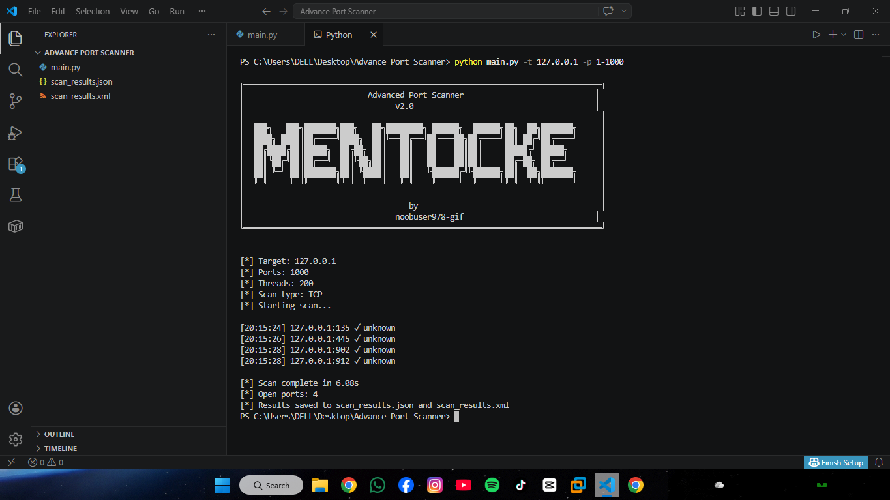

# Advanced Port Scanner
A high-performance, multi-threaded network port scanner built with Python. Designed for security professionals and network administrators to discover open ports, identify running services, and gather system information across networks.


## License

[Apache License 2.0 ]( http://www.apache.org/licenses/)


## Screenshots




## Author

- [noobuser978-gif](https://www.github.com/noobuser978-gif
)


## Usage

below the command is the step to run this port scanner

```bash
  python main.py -t <target> [options]
```
where options are given below with example:-

options

- -t, --target:-Target IP address e.g -t 192.168.1.1

- -p, --ports:-Ports to scan e.g -p 1-1000 or -p 22,80,443

- --threads:-Number of threads e.g --threads 500

- --type:-Scan type (tcp/udp/syn)	e.g --type udp

- --timeout:-Socket timeout (seconds)	e.g --timeout 2

- --rate-limit:-Delay between scans e.g --rate-limit 0.01

## Features

- Stable operation on Windows/Linux

- Actual working OS fingerprinting

- Progress tracking

- Better error handling

- Configurable rate limiting (can be disabled)

- Proper thread management


## Installation

Install this project its zip file and extract it or copy thi code and paste it the linux teminal

```bash
  git clone https://github.com/yourusername/advanced-port-scanner.git
cd advanced-port-scanner
```
    
## Examples
```bash
# Scan default ports (1-1024) on a target
python main.py -t 192.168.1.1

# Scan specific ports
python main.py -t 192.168.1.1 -p 22,80,443

# Scan port range
python main.py -t 192.168.1.1 -p 1-1000

# UDP scan
python main.py -t 192.168.1.1 --type udp

# TCP scan with custom threads
python main.py -t 192.168.1.1 --threads 500
```
## Optimizations

[v2.1]

- IPv6 support

- CSV output format

- Progress bar with tqdm

- Async I/O with asyncio

- Connection pooling and reuse
## 🔥Disclaimer🔥

This tool is intended for authorized security testing and educational purposes only. Unauthorized scanning of networks or systems may violate local laws and regulations. Use responsibly.
